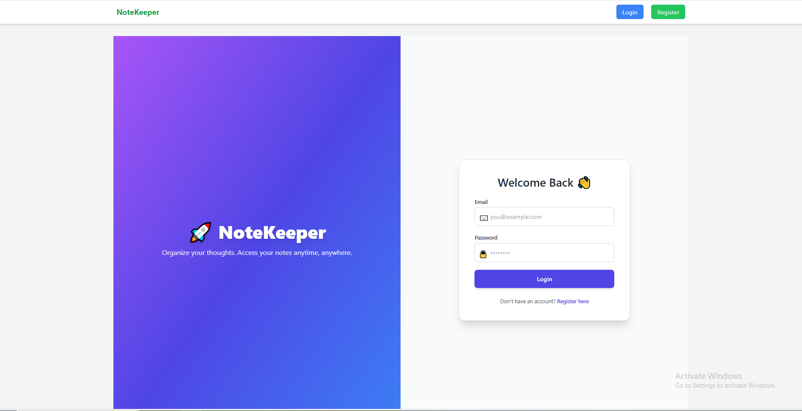
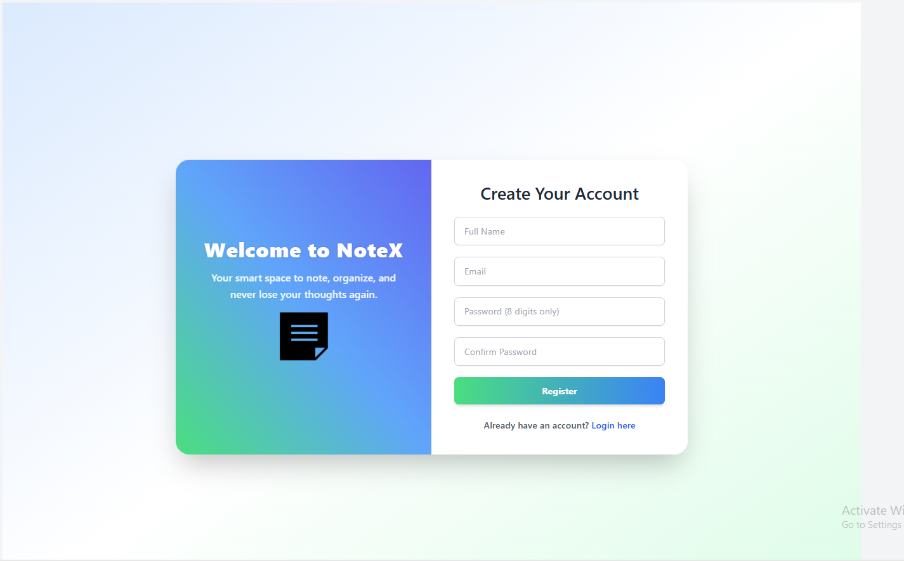
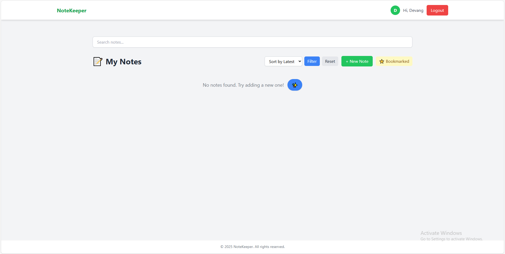
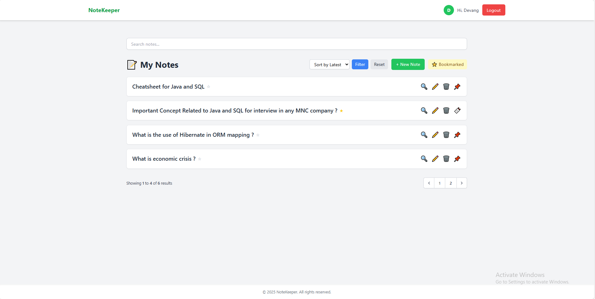
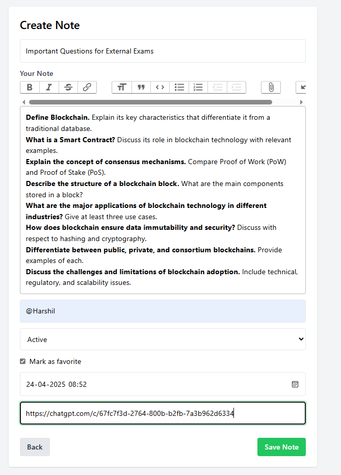
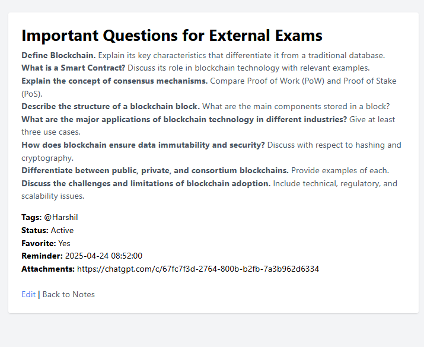
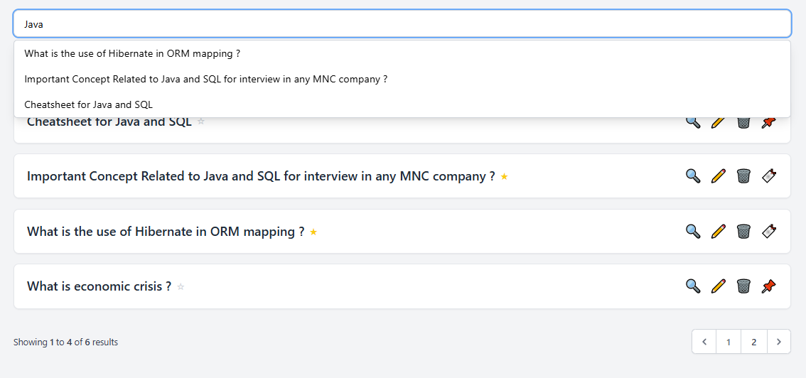
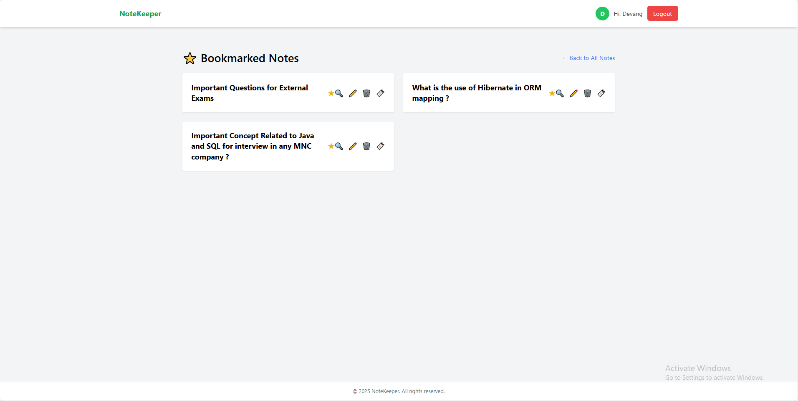

# 📝 NoteKeeper App - Laravel 12

A simple yet powerful NoteKeeper application built with **Laravel 12**. This app allows users to **create, manage, search, and bookmark** notes. Authentication is implemented to ensure notes are **user-specific** and secure.

## 🚀 Features

- 🔐 **User Authentication** (Login/Register) via personal access token
- 📝 **CRUD Operations** for Notes (Create, Read, Update, Delete)
- 📌 **Bookmark Notes** to pin important ones
- 🔎 **Search Functionality** to find notes easily
- 🎨 Clean and simple UI with Blade templates
- 🧩 Built on Laravel 11 with modern practices

## 🏗️ Tech Stack

- **Framework**: Laravel 11 (PHP 8.2)
- **Authentication**: Laravel Passport
- **Database**: MySQL
- **Templating**: Blade
- **Styling**: Tailwind CSS

## 📸 Screenshots

> Add screenshots here (e.g., login screen, note list, create note, bookmark view, search results)

### 🔐 Login Page



### 👤 Register Page


### 📋 Notes Dashboard


### 📊 Dashboards View



### 📝 Create Note Page


### 👁️ View Note Page


### 🔍 Search Results


### 📌 Bookmarked Notes


## 🛠️ Installation

1. Clone the repository:

   ```bash
   git clone https://github.com/your-username/notekeeper-app.git
   cd notekeeper-app
   ```

2. Install dependencies:

   ```bash
   composer install
   npm install && npm run dev
   ```

3. Copy `.env` and set up your environment:

   ```bash
   cp .env.example .env
   php artisan key:generate
   ```

4. Configure your `.env` file with your database credentials:

   ```env
   DB_DATABASE=your_db_name
   DB_USERNAME=your_username
   DB_PASSWORD=your_password
   ```

5. Run migrations:

   ```bash
   php artisan migrate
   ```

6. Install and run Laravel Passport:

  ### Step 1: Install Laravel Passport

1. **Install Laravel Passport via Composer**:

   ```bash
   composer require laravel/passport
2. **Generate the OAuth clients manually**:
   ```bash
   php artisan passport:client

   ```

7. Serve the application:

   ```bash
   php artisan serve
   ```

Visit `http://localhost:8000` to start using the NoteKeeper App.

## 📁 Project Structure

```
├── app/
│   └── Http/
│       ├── Controllers/
│       │   ├── ApiAuthController.php
│       │   ├── AuthController.php
│       │   ├── Controller.php
│       │   ├── NoteController.php
│       │   └── WebAuthController.php
│       ├── Middleware/
│       │   └── PreventBackHistory.php
│       └── Requests/
│           ├── LoginRequest.php
│           ├── RegisterRequest.php
│           ├── StoreNoteRequest.php
│           └── UpdateNoteRequest.php
├── app/Models/
│   └── Note.php
├── database/
│   └── migrations/
│       └── xxxx_xx_xx_create_notes_table.php
├── resources/
│   ├── views/
│   │   ├── auth/
│   │   │   ├── login.blade.php
│   │   │   ├── register.blade.php
│   │   │   └── verify-otp.blade.php
│   │   ├── layouts/
│   │   │   └── app.blade.php
│   │   └── notes/
│   │       ├── create.blade.php
│   │       ├── edit.blade.php
│   │       ├── index.blade.php
│   │       ├── show.blade.php
│   │       ├── user-bookmarked.blade.php
│   │       └── partials/
│   │           ├── form.blade.php
│   │           └── bookmarked.blade.php
│   ├── css/
│   └── js/
├── routes/
│   └── web.php
├── public/
├── config/
├── bootstrap/

```

## 📌 Note

- Only authenticated users can manage their notes.
- Notes are private and user-specific.
- Bookmarked notes can be toggled with a button.
- Search is performed on both title and content fields.

## 🤝 Contributing

Pull requests are welcome. For major changes, please open an issue first to discuss what you would like to change.

## 📄 License

This project is open-sourced under the MIT license.
